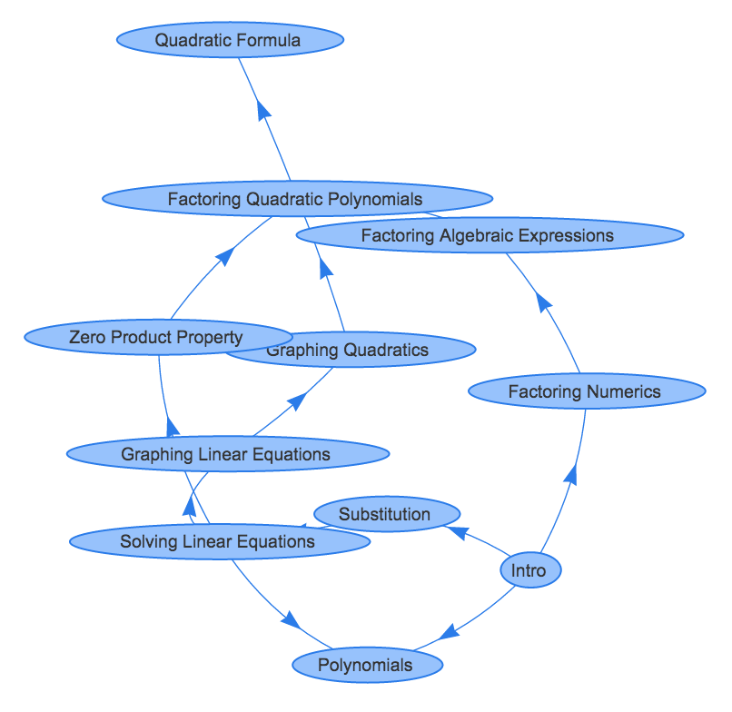

#&nbsp;giraffe

Giraffe is an in-memory directional graph and key value store. Giraffe is a work in progress. I want to add the ability to make giraffe an actual datastore with an exposed tcp or rest api, and eventually make it distributed.

You can check out the full documentation on [godoc.org](https://godoc.org/github.com/sethgrid/giraffe)

# What can giraffe do?
The current API supports:
- creating a graph object (with or without constraints like preventing duplicate keys or circular relationships)
- adding / deleting nodes
- adding / removing relationships between nodes
- assigning a node a key and value
- save and load graphs using GobEncoder
- searching nodes
- creating an HTML/Javascript view of the graph leveraging visjs.org
- safe to use concurrently

# Full Example

```go
package main

import (
    "fmt"
    "io/ioutil"
    "log"
    "math/rand"
    "time"

    "github.com/sethgrid/giraffe"
)

func main() {
    g, _ := giraffe.NewConstraintGraph("math curriculum", true, true)

    root := g.Root() // same as g.Nodes[0]

    // this will be the entry point into the curriculum
    // Keys will be lesson titles, Values will be a foreign key into a relational DB (or something)
    root.Key = "Intro"
    root.Value = []byte("lesson_id 1")

    // this will be the culmination of this curriculum
    QF, _ := g.InsertDataNode("Quadratic Formula", []byte("lesson_id 55"))

    // All the different lessons that lead up to being able to understand the Quadratic Formula
    FQP, _ := g.InsertDataNode("Factoring Quadratic Polynomials", []byte("lesson_id 52"))
    FAE, _ := g.InsertDataNode("Factoring Algebraic Expressions", []byte("lesson_id 45"))
    FN, _ := g.InsertDataNode("Factoring Numerics", []byte("lesson_id 12"))
    GQ, _ := g.InsertDataNode("Graphing Quadratics", []byte("lesson_id 32"))
    GL, _ := g.InsertDataNode("Graphing Linear Equations", []byte("lesson_id 19"))
    SLE, _ := g.InsertDataNode("Solving Linear Equations", []byte("lesson_id 17"))
    ZPP, _ := g.InsertDataNode("Zero Product Property", []byte("lesson_id 27"))
    POLY, _ := g.InsertDataNode("Polynomials", []byte("lesson_id 9"))
    SUB, _ := g.InsertDataNode("Substitution", []byte("lesson_id 5"))

    // mapping relationships
    FN.AddRelationship(FAE)
    FAE.AddRelationship(FQP)
    GL.AddRelationship(GQ)
    GQ.AddRelationship(FQP)
    FQP.AddRelationship(QF)
    ZPP.AddRelationship(FQP)
    SUB.AddRelationship(SLE)
    SLE.AddRelationship(POLY)
    SLE.AddRelationship(ZPP)
    SLE.AddRelationship(GL)
    root.AddRelationship(FN)
    root.AddRelationship(POLY)
    root.AddRelationship(SUB)

    // save
    data, _ := g.GobEncode()
    ioutil.WriteFile("someFile", data, 0766)

    // load
    restoredGraph := &giraffe.Graph{}
    restoredGraph.GobDecode(data)

    // visualize
    fmt.Println(restoredGraph.ToVisJS(false, true, false))
}
```

The above code would create a backup file of the graph and an html output of a VisJS interactive graph similar to the image below (note: the graph is an example and not necessarily a real model of knowledge scaffolding). 

